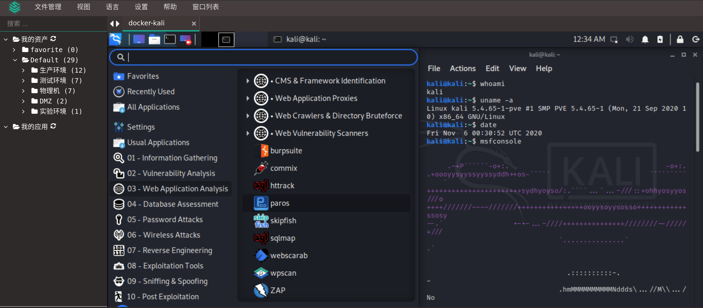

# docker-compose构建远程桌面kali
## 背景
公司机房虚拟机全是由 Centos 模板产生，又不支持嵌套虚拟化，但 Kali 又是基于 Debian 系统，没有办法，只有利用 Docker 来搞事情了。

## 目标
易雾君想要申请一台全新的虚机，部署好 Kali 基础环境，最重要的是 Kali 2020 主题，太爱了。还有就是能通过 3389 远程接入系统，尤其是 Jumserver 基于 rdp 接入 Kali 后自适应分辨率，使用体验简直了。那跟着易雾君的节拍来一步步搞定它。

## 操作指南
易雾君考虑大家伙的操作便利性，习惯采用 docker-compose 来一键编排。

### 文件目录结构
```bash
|-- kali
	|-- app
		|-- Dockerfile
	|-- docker-compose.yml
	|-- .env	# 存放用户名密码环境变量
	
```

### 配置用户名密码
打开项目根目录下的 .env 环境变量配置文件，一定记得修改为自己的复杂密码，默认是很弱的。
```bash
KALI_USER=kali
KALI_PASSWORD=kali@123!
```
### 构建镜像文件
```bash
# 基于 kali 官方镜像 rolling 版
FROM kalilinux/kali-rolling  

LABEL maintainer="evling2020@gmail.com"

# 引入环境变量
ARG KALI_USER
ARG KALI_PASSWORD
env KALI_USER=${KALI_USER} \
    KALI_PASSWROD=${KALI_PASSWORD}

# 安装 kali 基础环境，选取 kali-linux-large
RUN apt-get -y update && apt-get -y upgrade && \
   DEBIAN_FRONTEND=noninteractive apt-get install -y \
   kali-linux-large \
   pciutils \
   bash-completion && \
   apt-get autoremove -y && \
   apt-get clean

RUN printf "alias ll='ls $LS_OPTIONS -l'\nalias l='ls $LS_OPTIONS -lA'\n\n# enable bash completion in interactive shells\nif [ -f /etc/bash_completion ] && ! shopt -oq posix; then\n    . /etc/bash_completion\nfi\n" > /root/.bashrc

# 待挂载工作目录，将它映射到宿主机，常用临时工具或者文件放这里
RUN mkdir /data

# 安装远程桌面环境 kali-desktop-xfce、远程桌面服务 xrdp
RUN apt-get -y install kali-desktop-xfce xorg xrdp iputils-ping
RUN useradd -ms /bin/bash $KALI_USER
RUN echo '$KALI_USER:$KALI_PASSWORD' |chpasswd
RUN echo "$KALI_USER    ALL=(ALL) ALL" >> /etc/sudoers

# 对外暴露 3389 端口
EXPOSE 3389
VOLUME /data /root /home/$KALI_USER
ENTRYPOINT /etc/init.d/xrdp start && tail -F /var/log/xrdp-kali.log
```

### 获取打包文件
- 资源链接： https://pan.evling.me/s/AZH5WecYGzCHR9b
- 访问密码： 关注公众号 `易雾山庄` ，回复 `获取密码` 即可得到访问密码，主要考虑到恶意爬虫对流量造成浪费，故增加这么个环节，望理解。

### 一键部署
机器预先安装好 docker 和 docker-compose ，解压项目文件，按照上文配置后执行指令即可。
```bash
$ tar -zxvf kali_on_docker.tar.gz
$ cd kali
$ docker-compose up -d
```

## 远程接入
可以利用 Windows 下的 mstsc 工具直接连接，帐号即上文中的配置，易雾君强烈安利各位条件允许的话部署 Jumpserver 接入，自适应分辨率，体验尤佳。感受下真容




